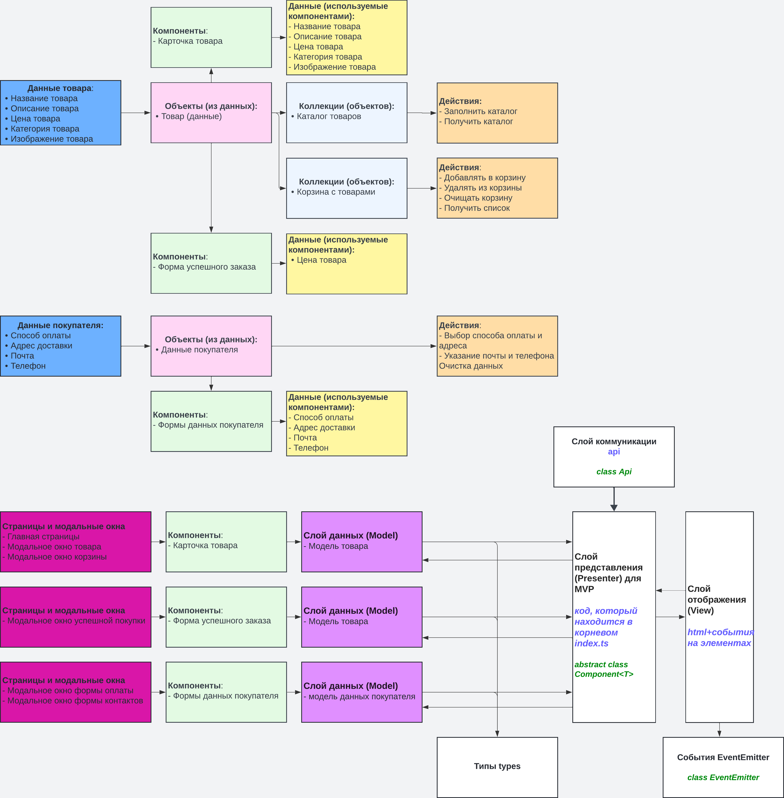

# Проектная работа "Веб-ларек"

Стек: HTML, SCSS, TS, Webpack

Структура проекта:
- src/ — исходные файлы проекта
- src/components/ — папка с JS компонентами
- src/components/base/ — папка с базовым кодом

Важные файлы:
- src/pages/index.html — HTML-файл главной страницы
- src/types/index.ts — файл с типами
- src/index.ts — точка входа приложения
- src/styles/styles.scss — корневой файл стилей
- src/utils/constants.ts — файл с константами
- src/utils/utils.ts — файл с утилитами

Описание базовых классов:
- Класс EventEmitter обеспечивает работу событий. Его функции: установить и снять слушателей событий, вызвать слушателей при возникновении события

    Методы:
  - on - установить обработчик на событие
  - off - снять обработчик с события
  - emit - инициировать событие с данными
  - onAll - слушать все события
  - offAll - сбросить все обработчики
  - trigger - сделать коллбек триггер, генерирующий событие при вызове

- Класс Api обеспечивает взаимодействие с сервером. Его функции: выполнить get и post запросы для получения списка продуктов и конкретного продукта

    Методы:
  - get - выполняет get запрос 
  - post - выполняет post запрос

- Класс Component обеспечивает методами для работы с DOM. Его функции: устанавливать данные в компонентах, а также отрисовывать их

    Методы:
  - toggleClass - переключить класс
  - setText - установить текстовое содержимое
  - setDisabled - сменить статус блокировки
  - setHidden - скрыть
  - setVisible - показать
  - setImage - установить изображение с альтернативным текстом
  - render - вернуть корневой DOM-элемент

- Класс Model - абстрактный класс для слоя данных. Его функции: получить данные и события, чтобы уведомлять что данные поменялись

    Методы:
  - emitChanges - сообщить всем что модель поменялась

# UML схема


# Схема приложения


## Установка и запуск
Для установки и запуска проекта необходимо выполнить команды

```
npm install
npm run start
```

или

```
yarn
yarn start
```
## Сборка

```
npm run build
```

или

```
yarn build
```
