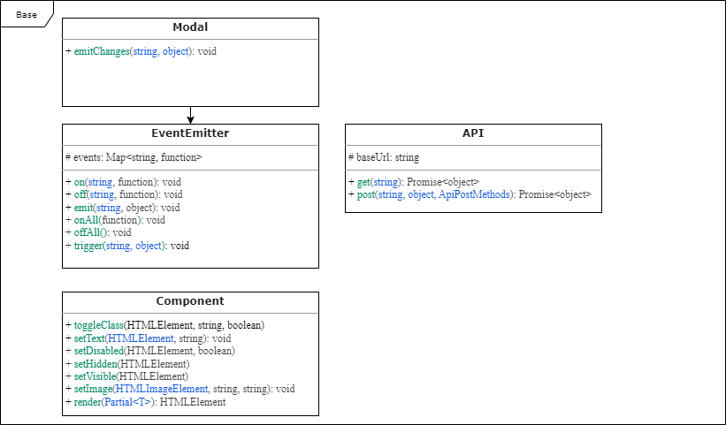

# Проектная работа "Веб-ларек"

Стек: HTML, SCSS, TS, Webpack

Структура проекта:
- src/ — исходные файлы проекта
- src/components/ — папка с JS компонентами
- src/components/base/ — папка с базовым кодом

Важные файлы:
- src/pages/index.html — HTML-файл главной страницы
- src/types/index.ts — файл с типами
- src/index.ts — точка входа приложения
- src/styles/styles.scss — корневой файл стилей
- src/utils/constants.ts — файл с константами
- src/utils/utils.ts — файл с утилитами

### Установка и запуск
Для установки и запуска проекта необходимо выполнить команды

```
npm install
npm run start
```

или

```
yarn
yarn start
```
### Сборка

```
npm run build
```

или

```
yarn build
```

### Паттерн проекта:
Использован паттерн MVP (Model-View-Presenter). Проект разделен на слои: 
- слой отображения (View), классы: Basket, Form, Modal, SuccessForm, Card, ContactForm, DeliverForm, Page
- слой представления (Presenter): соединение Model и View через навешивания событий в файле index.ts
- слой данных (Model), классы: AppData + LarekAPI (слой коммуникации)

### Описание базовых классов:
- **Класс EventEmitter** обеспечивает работу событий. Его функции: установить и снять слушателей событий, вызвать слушателей при возникновении события. 
Использован паттерн «Observer», который позволяет подписаться и уведомлять о событиях.
  #### Методы:
  - on(eventName: EventName, callback: (event: T) => void) - установить обработчик на событие
  - off(eventName: EventName, callback: Subscriber) - снять обработчик с события
  - emit(eventName: string, data?: T) - инициировать событие с данными
  - onAll(callback: (event: EmitterEvent) => void) - слушать все события
  - offAll() - сбросить все обработчики
  - trigger(eventName: string, context?: Partial<T>) - сделать коллбек триггер, генерирующий событие при вызове


- **Класс Api** обеспечивает взаимодействие с сервером. Его функции: выполнить get и post запросы для получения списка продуктов и конкретного продукта.
    #### Методы:
  - get(uri: string) - выполняет get запрос на сервер
  - post(uri: string, data: object, method: ApiPostMethods) - выполняет post запрос на сервер


- **Класс Component** обеспечивает методами для работы с DOM. Его функции: устанавливать данные в компонентах, а также отрисовывать их
    #### Методы:
  - toggleClass(element: HTMLElement, className: string, force?: boolean) - переключить класс
  - setText(element: HTMLElement, value: string) - установить текстовое содержимое
  - setDisabled(element: HTMLElement, state: boolean) - сменить статус блокировки
  - setHidden(element: HTMLElement) - скрыть компонент
  - setVisible(element: HTMLElement) - показать компонент
  - setImage(element: HTMLImageElement, src: string, alt?: string) - установить изображение с альтернативным текстом
  - render(data?: Partial<T>) - вернуть корневой DOM-элемент


- **Класс Model** - абстрактный класс для слоя данных. Его функции: получить данные и события, чтобы уведомлять что данные поменялись
    #### Методы:
  - emitChanges(event: string, payload?: object) - сообщить всем что модель поменялась

# UML схема


файл добавлен в проект и [отображается](https://github.com/Sogdian/web-larek-frontend/blob/main/src/images/UML.png)

### API
```TypeScript
//Класс для взаимодействия с сервером, наследуется от класса Api (реализация слоя Model)
//Методы класса используются для получения данных с сервера и предоставления данных в Presenter для отображения в компонентах (View)
export class LarekAPI extends Api implements ILarekAPI {
    //API_ORIGIN
    readonly cdn: string;

    constructor(cdn: string, baseUrl: string, options?: RequestInit)

    //получить товар
    getProduct(id: string): Promise<ICard>

    //получить список товаров
    getProductList(): Promise<ICard[]> 
}
```

### Типы данных
```TypeScript
//данные приложения
export interface IAppData {
  catalog: IProduct[]; //список товаров
  basket: IProduct[]; //информация из корзины
  order: IOrder | null; //информация для заказа
}

//главная страница
export interface IPage {
  list: HTMLElement[]; //список товаров
}

//товар
export interface IProduct {
  id: string; //id товара
  category: Category; //категория товара
  title: string; //наименование товара
  description: string; //описание товара
  image: string; //изображение товара
  price: number | null; //цена товара
  selected?: boolean; //выбран ли товар
}

//карточка товара
export interface ICard extends IProduct {
  selected: boolean; //в корзине ли товар
}

//модальное окно для оформления доставки
export interface IDeliverForm {
  address: string; //адрес доставки
  payment: string; //способ оплаты
}

//модальное окно Контакты
export interface IContactForm {
  email: string; //email
  phone: string; //телефон
}

//корзина
export interface IBasket {
  items: HTMLElement[]; //список товаров
  price: number; //стоимость заказа
}

//заказ
export interface IOrder extends IDeliverForm, IContactForm {
  items: string[]; //список id товаров
  total: number; //общая сумма заказа
}

//успешное оформление заказа
export interface IOrderSuccess {
  id: string; //id заказа
  count: number; //количество списанных синапсов
}

//любое модальное окно
export interface IModal {
  //содержимое
  content: HTMLElement;
}

//окно формы
export interface IForm {
  valid: boolean; //валидность формы
  errors: string[]; //ошибки в форме
}
```
### Слой данных
```TypeScript
//Класс для управления состоянием приложения, т.е. для хранение данных (реализация слоя Model), наследуется от класса Model
//Класс получает, передает, хранит и удаляет данные, которые используются Presenter'ом (данные приходят и отправляются в Presenter)
//Например, в Presenter (index.ts) вызывается эксземпляр класса AppData и происходит передача данных, например товара (Product) используя метод (add) класса AppData
  export class AppData extends Model<IAppData> {
    //получение списка товаров
    setCatalog(items: IProduct[]): void

    //добавление товара в корзину
    add(value: Product): void

    //удаление товара из корзины
    remove(id: string): void

    //подсчет количества товаров
    get count(): void

    //получение итоговой суммы заказа в корзине
    get totalPrice(): void

    //добавление данных покупателя
    setDataBuyer(): void

    //очистка корзины
    resetBasket(): void

    //очистка данных покупателя
    resetOrder(): void
}
```

### Общие компоненты
```TypeScript
//Класс для работы с корзиной, наследуется от класса Component (реализация слоя View)
//Класс используется для управления отображением данных (товаров, цены) в компоненте корзины   
class Basket extends Component<IBasket> {
    constructor(container: HTMLElement, protected events: EventEmitter) {
        super(container);
    }

    //установка списка товаров
    set items(items: HTMLElement[]): void

    //установка цены
    set price(value: number): void

    //блокировка кнопки
    disableButton(value: boolean): void
}

//Класс для работы с формами, наследуется от класса Component (реализация слоя View)
//Класс используется для установки значения валидности и передачу ошибок в компонент, а также для отображения компонента (render) формы заполнения данных
class Form<T> extends Component<IForm> {
  constructor(protected container: HTMLFormElement, protected events: IEvents) {
    super(container);
  }

  //изменение поля в заказе
  protected onInputChange(field: keyof T, value: string): void

  //установка значения валидности
  set valid(value: boolean): void

  //передача ошибок в форме
  set errors(value: string): void

  //отображение формы
  render(state: Partial<T> & IForm): void
}

//Класс для работы с модальными окнами, наследуется от класса Component (реализация слоя View)
//Класс используется для управления состоянием (открыт, закрыт) и отображением компонента (render) модального окна
class Modal extends Component<IModal> {
  constructor(container: HTMLElement, protected events: IEvents) {
    super(container);
  }

  //установка значения в модальном окне
  set content(value: HTMLElement): void

  //открытие модального окна
  open(): void

  //закрытие модального окна
  close(): void

  //отображение модального окна
  render(data: IModal): HTMLElement
}

//Класс для работы с окном успешного оформления заказа, наследуется от класса Component (реализация слоя View)
//Класс используется для управления отображением данных (стоимость товара) в компоненте модального окна успешного оформления заказа
class SuccessForm extends Component<IOrderSuccess> {
  constructor(container: HTMLElement) {
    super(container);
  }

  //установка количества списанных синапсов
  set count(value: number): void
}
```

### Компоненты предметной области
```TypeScript
//Класс для управления отображением информации о продукте, наследуется от класса Component (реализация слоя View)
//Класс используется для управления отображением данных (название, картинка) в компоненте карточки товара
class Card extends Component<ICard> {
  constructor(container: HTMLElement) {
    super(container);
  }

  //установка текста в карточку
  set title(value: string): void

  //получение текста в карточке
  get title(): string

  //установка изображения в карточку
  set image(value: string): void

  //установка описания в карточку
  set description(value: string)

  //получение описания в карточке
  get description(): string

  //установка категории товара
  set category(value: Category): void
}

//Класс для управления отображением формы Контакты, наследуется от класса Form (реализация слоя View)
//Класс используется для управления отображением данных (телефон, почта) в компоненте формы заполнения данных пользователя
class ContactForm extends Form<IContactForm> {
  constructor(container: HTMLFormElement, events: IEvents) {
    super(container, events);
  }

  //установка номера телефона
  set phone(value: string): void

  //установка почты
  set email(value: string): void
}

//Класс для управления отображением формы оформления доставки, наследуется от класса Form (реализация слоя View)
//Класс используется для управления отображением данных (адрес) в компоненте формы заполнения данных пользователя
class DeliverForm extends Form<IDeliverForm> {
  constructor(container: HTMLFormElement, events: IEvents) {
    super(container, events);
  }

  //установка адреса заказа
  set address(value: string): void
}

//Класс для управления элементами главной страницы, наследуется от класса Component (реализация слоя View)
//Класс используется для управления состоянием страницы и отображением товаров на странице
class Page extends Component<IPage> {
  constructor(container: HTMLElement, protected events: IEvents) {
    super(container);
  }

  //установка списка товаров на странице
  set list(items: HTMLElement[]): void

  //установка блокировки на странице
  set blocked(value: boolean): void
}
```


