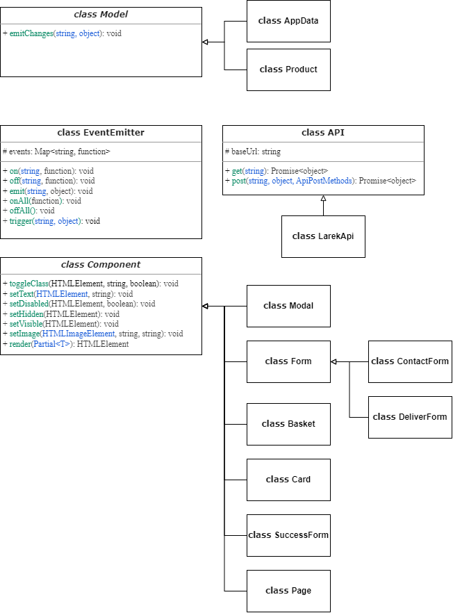

# Проектная работа "Веб-ларек"

Стек: HTML, SCSS, TS, Webpack

Структура проекта:
- src/ — исходные файлы проекта
- src/components/ — папка с JS компонентами
- src/components/base/ — папка с базовым кодом

Важные файлы:
- src/pages/index.html — HTML-файл главной страницы
- src/types/index.ts — файл с типами
- src/index.ts — точка входа приложения
- src/styles/styles.scss — корневой файл стилей
- src/utils/constants.ts — файл с константами
- src/utils/utils.ts — файл с утилитами

### Описание базовых классов:
- **Класс EventEmitter** обеспечивает работу событий. Его функции: установить и снять слушателей событий, вызвать слушателей при возникновении события

  #### Методы:
  - on - установить обработчик на событие
  - off - снять обработчик с события
  - emit - инициировать событие с данными
  - onAll - слушать все события
  - offAll - сбросить все обработчики
  - trigger - сделать коллбек триггер, генерирующий событие при вызове


- **Класс Api** обеспечивает взаимодействие с сервером. Его функции: выполнить get и post запросы для получения списка продуктов и конкретного продукта

    #### Методы:
  - get - выполняет get запрос на сервер
  - post - выполняет post запрос на сервер


- **Класс Component** обеспечивает методами для работы с DOM. Его функции: устанавливать данные в компонентах, а также отрисовывать их
    #### Методы:
  - toggleClass - переключить класс
  - setText - установить текстовое содержимое
  - setDisabled - сменить статус блокировки
  - setHidden - скрыть компонент
  - setVisible - показать компонент
  - setImage - установить изображение с альтернативным текстом
  - render - вернуть корневой DOM-элемент


- **Класс Model** - абстрактный класс для слоя данных. Его функции: получить данные и события, чтобы уведомлять что данные поменялись

    #### Методы:
  - emitChanges - сообщить всем что модель поменялась

# UML схема


### Типы данных
```TypeScript
//данные приложения
export interface IAppData {
    catalog: IProduct[]; //список товаров
    basket: IProduct[]; //информация из корзины
    order: IOrder | null; //информация для заказа
}

//главная страница
export interface IPage {
    list: HTMLElement[]; //список товаров
}

//интерфейс товара
export interface IProduct {
    id: string; //id товара
    category: Category; //категория товара
    title: string; //наименование товара
    description: string; //описание товара
    image: string; //изображение товара
    price: number | null; //цена товара
    selected?: boolean; //выбран ли товар
}

//интерфейс карточки товара
export interface ICard extends IProduct {
    selected: boolean; //в корзине ли товар
}

//модальное окно для оформления доставки
export interface IDeliverForm {
    address: string; //адрес доставки
    payment: string; //способ оплаты
}

//модальное окно Контакты
export interface IContactForm {
    email: string; //email
    phone: string; //телефон
}

//корзина
export interface IBasket {
    items: HTMLElement[]; //список товаров
    price: number; //стоимость заказа
}

//заказ
export interface IOrder extends IDeliverForm, IContactForm {
    items: string[]; //список id товаров
    total: number; //общая сумма заказа
}

//успешное оформление заказа
export interface IOrderSuccess {
    id: string; //id заказа
    total: number; //количество списанных синапсов
}
```

### API
```TypeScript
export interface ILarekAPI {
    getProduct: (id: string) => Promise<ICard>;
    getProductList: () => Promise<ICard[]>;
}

export class LarekAPI extends Api implements ILarekAPI {
    //API_ORIGIN
    readonly cdn: string;

    constructor(cdn: string, baseUrl: string, options?: RequestInit)

    //получить товар
    getProduct(id: string): Promise<ICard>

    //получить список товаров
    getProductList(): Promise<ICard[]> 
}
```

### Модели данных
```TypeScript
//Класс для хранение данных
export class AppData extends Model<IAppData> {
    catalog: IProduct[];
    basket: IProduct[] = [];
    order: IOrder;

    //получение списка товаров
    setCatalog(items: IProduct[]): void

    //добавление товара в корзину
    add(value: Product): void

    //удаление товара из корзины
    remove(id: string): void

    //подсчет количества товаров
    get count(): void

    //получение итоговой суммы заказа в корзине
    get totalPrice(): void

    //добавление данных покупателя
    setDataBuyer(): void

    //очистка корзины
    resetBasket(): void

    //очистка данных покупателя
    resetOrder(): void
}

```

## Установка и запуск
Для установки и запуска проекта необходимо выполнить команды

```
npm install
npm run start
```

или

```
yarn
yarn start
```
## Сборка

```
npm run build
```

или

```
yarn build
```
